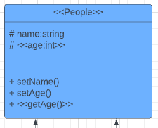
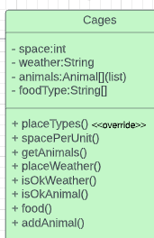
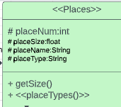
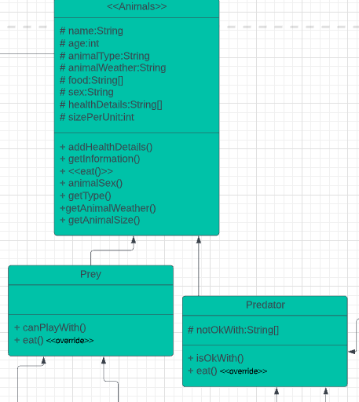
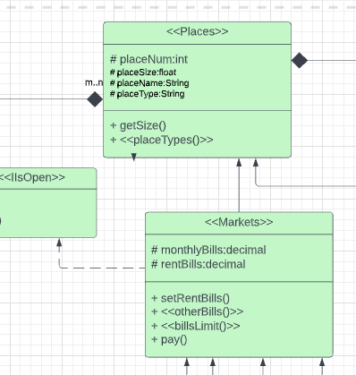
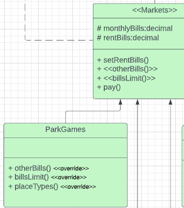
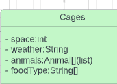
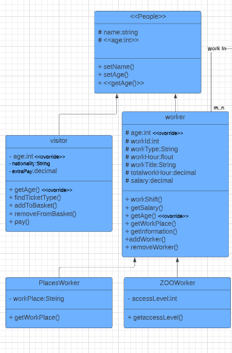
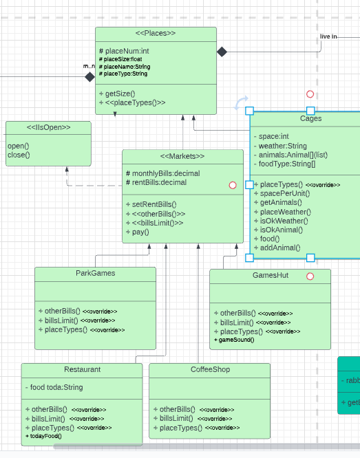

# ZOO 
----

## :mag_right: **Overview**

this program manages the places in the zoo and the behavior of everyone in their `Worker` `visitor` `Animals` and creates classes for everyone.

like
- `Visitor` class have tow important property to decide how the ticket price
  1. **age**  in this we decide if they a child ticket discount or normal price.
  2. **nationality** in this we decide if they will get a foreign ticket or a normal one.
  
- `Cages` class some of his feathers that we check if the cage has the wither conditions for animals (`cold` :snowflake: `water` :ocean: `desert` :dromedary_camel: .... etc) and the animal in the cage if can live together or not

- in `Animal` class we create `HealthDetails` that give us details for not just his ailments and also about it the married or pregnant and other details.

In this project one of the important thing that i use is the OOP principles the importance and the smoothness that make for code like.

 
1. **Abstract**

is the meaning of class itself to breakdown your code to smaller pieces and reduce the size of the code 

  like: 

all the classes that we create 

2. **Encapsulation**
and also when we talk about the class we talk about encapsulation to get limitation for access and hide the data that what give our code more `Security` and provides necessary data to view.

  like:  

the access modifiers

  
  

3. **Inheritance** 

this is the most important principle to reduce the duplication of code and give us code less size and more clear 

  like: 

the meaning of father class and child class in many parts

  
  

4. **Polymorphism**
when we use the inheritance we make our code more static in this moment come smooth and flexibility of polymorphism that we can edit inherited class as we like without making changes in the base class.

  like:  

the owerrides in all around the diagram

  
  

all these principles what make our code have `Reusability` `Security` `flexibility` `smooth` `easy to read and write`.

----
## :movie_camera: UML Diagram

- **All the Diagram**

    

- **People Part**
    

- **Animal Part**
    

-**Places Part**

    

